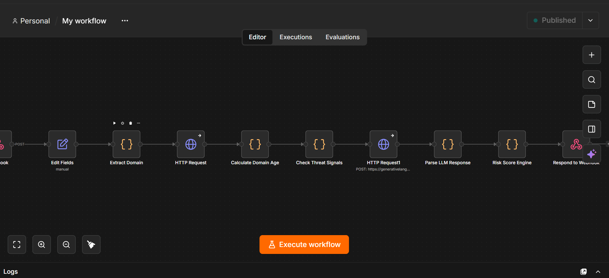

# 🛡️ PayShield — AI Scam Detection Before Payment

**What if your phone could recognize a scam before you pay?**

Most fraud detection systems alert you *after* something suspicious happens. PayShield intervenes *at the decision point* — before money leaves your account.

## 🚨 The Problem

Scammers are increasingly targeting the moment right before a payment: a suspicious link, a fake merchant site, an urgent payment request. By the time banks flag it, the money's often already gone.

## 💡 Our Solution

PayShield analyzes a shared link or payment-related message in real time and returns a clear risk verdict — **SAFE**, **SUSPICIOUS**, or **SCAM** — along with the exact reasons behind that score, before the user pays.

## 🧠 How It Works

1. User shares/pastes a suspicious link or message into the PayShield app
2. The request hits our automation backend, which runs multiple independent checks in parallel:
   - **Domain age verification** (via RDAP) — newly registered domains are a strong scam signal
   - **Heuristic threat pattern analysis** — suspicious TLDs, excessive hyphens, brand-lookalike domains
   - **AI-powered message analysis** (Gemini LLM) — detects urgency language, brand impersonation, and identity mismatches in the message text
3. A weighted risk scoring engine combines all signals into a single 0-100 score and verdict
4. The user sees the verdict **and the reasoning** — not a black-box score — so they can verify it themselves before deciding to pay

## 🏗️ Architecture

- **Orchestration/Backend**: n8n (workflow automation) — handles webhook intake, domain analysis, threat pattern checks, LLM calls, and risk scoring
- **Frontend**: React Native (Expo)
- **AI**: Google Gemini API
- **Domain Intelligence**: RDAP protocol

*(Backend logic lives in n8n cloud, not in this repo — see architecture screenshot below)*

## 📱 Try It

1. Scan the QR code to open the app in Expo Go
2. Paste or share a suspicious link/message
3. Get an instant risk verdict with reasons

## 🚧 Roadmap

- **Native share-intent integration**: register PayShield as an Android/iOS share target (via `expo-share-intent`) so users can share directly from WhatsApp/Instagram/SMS without switching apps manually — especially valuable for less tech-savvy and elderly users who may not know how to switch between apps
- Real-time threat intelligence API integration (Google Safe Browsing)
- Incident logging and a personal scam-history dashboard
- QR code and screenshot (OCR) input support

## 👥 Team

Built for Innovation Unbound, Round 2, by [Cassandra, Kirit, Yash, Rithanya, Arputha]

## 🔗 Links

- Live n8n backend: `https://kiritpayshield.app.n8n.cloud/webhook/scam-check`
